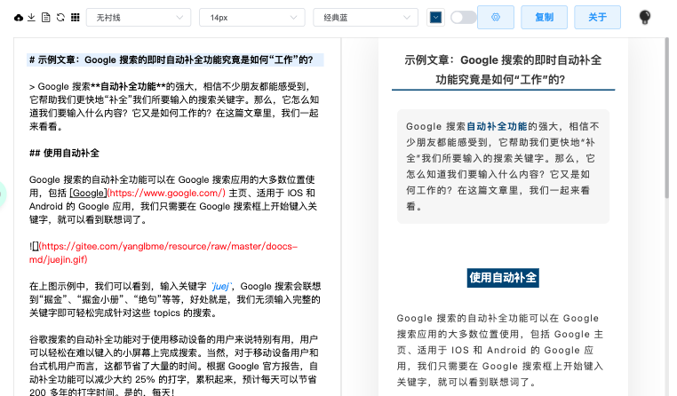

# [微信公众号 Markdown 排版工具](https://blog.zygd.site/%E5%BE%AE%E4%BF%A1%E5%85%AC%E4%BC%97%E5%8F%B7%20Markdown%20%E6%8E%92%E7%89%88%E5%B7%A5%E5%85%B7.html)

[](https://github.com/barretlee/online-markdown) [](https://github.com/softwarefly/online-markdown) [](https://hub.docker.com/r/xrsec/wxweb) [](https://github.com/XRSec/wxweb/actions/workflows/wxweb_docker_build.yml)

>  用于格式化 Markdown，粘贴到微信公众号的工具。





## 在线使用地址

<https://wxweb.zygd.site/>

<https://wxweb.vercel.app/#/>

## Docker 部署

### online-markdown

```bash
docker run -it -d \
    --restart=always \
    -p 5052:80 --name wxweb \
    xrsec/wxweb:online-markdown
```

### md

```
docker run -it -d \
    --restart=always \
    -p 5052:80 --name wxweb \
    xrsec/wxweb:latest
```

## 问题反馈 & 建议

<https://github.com/XRSec/wxweb/issues/new>

## 致谢

* [@Phodal](https://github.com/phodal)
* [@barretlee](https://github.com/barretlee)
* [@dyc87112](https://github.com/dyc87112)
* [@softwarefly](https://github.com/softwarefly/online-markdown)
* [@doocs](https://github.com/doocs/md.git)

> XRSec has the right to modify and interpret this article. If you want to reprint or disseminate this article, you must ensure the integrity of this article, including all contents such as copyright notice. Without the permission of the author, the content of this article shall not be modified or increased or decreased arbitrarily, and it shall not be used for commercial purposes in any way