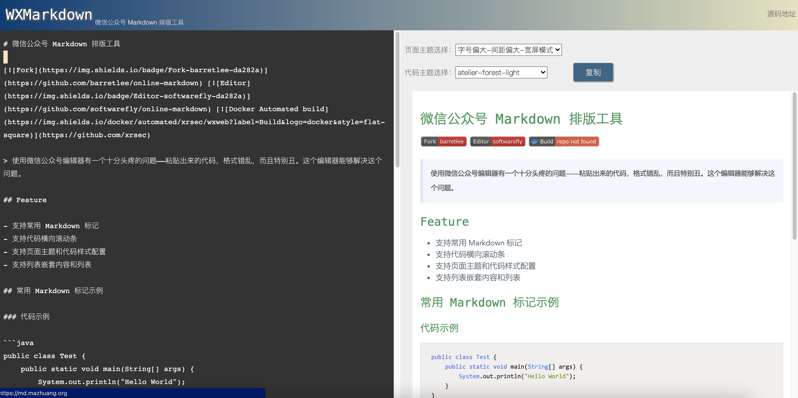

# 微信公众号 Markdown 排版工具

[](https://github.com/barretlee/online-markdown) [](https://github.com/softwarefly/online-markdown) [](https://hub.docker.com/r/xrsec/wxweb) [](https://github.com/XRSec/wxweb)

>  用于格式化 Markdown，粘贴到微信公众号的工具。



## 在线使用地址

<https://wxweb.zygd.site/>

## Docker 部署

```bash
docker run -it -d --restart=always -p 5052:80 --name wxweb wxweb:latest
```


## 问题反馈 & 建议

<https://github.com/softwarefly/online-markdown/issues/new>

## 致谢

* [@Phodal](https://github.com/phodal)
* [@barretlee](https://github.com/barretlee)
* [@dyc87112](https://github.com/dyc87112)
* [@softwarefly](https://github.com/softwarefly/online-markdown)
